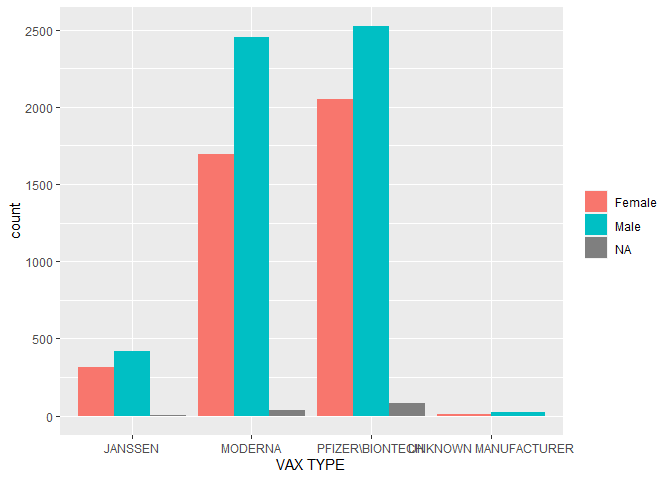

VAERS
================

The data is drawn from VAERS. The records are chosen if (1) Vaccination
data &gt;=January 1, 2021; (2) Vaccination type is “COVID 19”; and (3)
It was reported as death.

``` r
# Read data
temp<-as_tibble(read_csv(file="D:/Work/VAERS/2021VAERSData.csv",col_names = TRUE,
               col_types=cols(RECVDATE = col_date("%m/%d/%Y"),
                              VAX_DATE = col_date("%m/%d/%Y"),
                              DATEDIED = col_date("%m/%d/%Y"),
                              ONSET_DATE = col_date("%m/%d/%Y"),
                              TODAYS_DATE = col_date("%m/%d/%Y")
                              )
               ))

demo<- temp %>% filter(VAX_DATE >= as.Date("2021-01-01")) %>% select(VAERS_ID, RECVDATE, STATE, AGE_YRS, SEX, VAX_DATE, ONSET_DATE,DIED) 

vax<-as_tibble(read_csv(file="D:/Work/VAERS/2021VAERSVAX.csv",col_names = TRUE))

covid <- vax %>% filter(VAX_TYPE == "COVID19")
```

``` r
# Merge two data sets by VAERS_ID
vax_join<- inner_join (demo, covid, by= "VAERS_ID")
num_tot<-length(vax_join$VAERS_ID)

vax_join$AGE_YRS.group <- ifelse(vax_join$AGE_YRS <=20,"0-20",ifelse(vax_join$AGE_YRS <=40,"20-40",ifelse(vax_join$AGE_YRS <=60,"40-60","60-")))

vax_join$VAX_DATE.y_m <- format(as.Date(vax_join$VAX_DATE),"%Y-%m")

vax_join$DIED <- factor(vax_join$DIED,levels = c("Y",""),labels = c("Yes", "No"))
vax_join$SEX <- factor(vax_join$SEX,levels = c("F","M"),labels = c("Female", "Male"))
```

The death cases are selected.

| Died |    N |
|:-----|-----:|
| Yes  | 9597 |
| No   |    0 |

Here are the tables of demographic characteristics.

| Age   |    N |
|:------|-----:|
| 0-20  |   59 |
| 20-40 |  348 |
| 40-60 | 1239 |
| 60-   | 7833 |

| Gender |    N |
|:-------|-----:|
| Female | 4066 |
| Male   | 5412 |

| State |   N |
|:------|----:|
| AK    |  31 |
| AL    |  77 |
| AR    |  92 |
| AS    |   1 |
| AZ    | 111 |
| CA    | 522 |
| CO    | 108 |
| CT    |  53 |
| DC    |  15 |
| DE    |  25 |
| FL    | 450 |
| GA    | 354 |
| GU    |   2 |
| HI    |  38 |
| IA    |  85 |
| ID    |  22 |
| IL    | 286 |
| IN    | 146 |
| KS    |  74 |
| KY    | 689 |
| LA    |  64 |
| MA    | 131 |
| MD    |  97 |
| ME    |  38 |
| MI    | 424 |
| MN    | 357 |
| MO    | 200 |
| MP    |  15 |
| MS    |  54 |
| MT    |  81 |
| NC    | 133 |
| ND    |  46 |
| NE    |  49 |
| NH    |  63 |
| NJ    | 162 |
| NM    |  49 |
| NV    |  36 |
| NY    | 295 |
| OH    | 244 |
| OK    |  41 |
| OR    |  76 |
| PA    | 220 |
| PR    | 125 |
| RI    |  18 |
| SC    |  68 |
| SD    |  60 |
| TN    | 368 |
| TX    | 575 |
| UT    |  26 |
| VA    | 118 |
| VT    |  12 |
| WA    | 221 |
| WI    | 237 |
| WV    |  51 |
| WY    |  23 |
| XB    |   2 |

| Purpose |    N |
|:--------|-----:|
| COVID19 | 9597 |

| VAX manufacturer     |    N |
|:---------------------|-----:|
| JANSSEN              |  732 |
| MODERNA              | 4181 |
| PFIZER               | 4652 |
| UNKNOWN MANUFACTURER |   32 |

| Month   |    N |
|:--------|-----:|
| 2021-01 | 1815 |
| 2021-02 | 2495 |
| 2021-03 | 2375 |
| 2021-04 | 1368 |
| 2021-05 |  497 |
| 2021-06 |  246 |
| 2021-07 |  136 |
| 2021-08 |  200 |
| 2021-09 |  184 |
| 2021-10 |  154 |
| 2021-11 |  117 |
| 2021-12 |   10 |

Let’s look at a barplot for VAX type by gender.

<!-- -->
